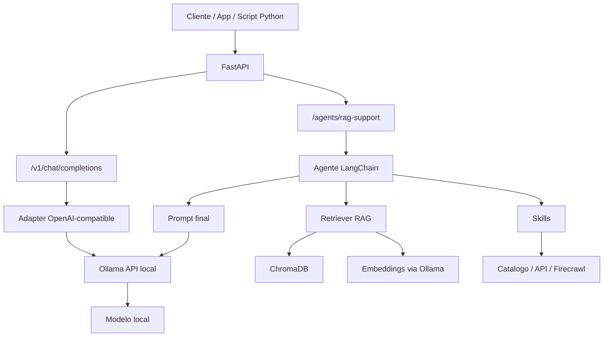

# API Ollama Local

Camada em `FastAPI` para expor um servidor `Ollama` local com:

- compatibilidade basica com a API da OpenAI
- agentes com `LangChain`
- workflows com `LangGraph`
- skills reutilizaveis
- RAG local com `ChromaDB`
- opcao de scraping e search com `Firecrawl`

Este projeto foi pensado para ser versionado no Git e crescer junto com a sua stack de agentes.

## Versao

`1.1.0`

## Visao geral

Este repositorio separa responsabilidades em camadas:

- `FastAPI`: expoe endpoints HTTP
- `Ollama`: executa o modelo local
- `LangChain`: organiza agentes, prompts e chamadas ao modelo
- `LangGraph`: orquestra fluxos com mais controle
- `skills/`: pequenas capacidades reutilizaveis
- `rag/`: ingestao e busca vetorial

Em resumo:

- o cliente chama a API
- a API decide qual fluxo usar
- um endpoint simples chama o Ollama quase direto
- um endpoint de agente pode consultar skills e RAG antes de responder

## O que sao agentes e skills

### Agentes

Agentes sao componentes que recebem um objetivo e decidem como responder usando modelo, contexto e ferramentas.

Exemplos:

- entender uma pergunta do usuario
- consultar uma base vetorial antes de responder
- combinar contexto recuperado com o modelo
- escolher qual skill usar

### Skills

Skills sao funcoes ou ferramentas pequenas e reutilizaveis que um agente pode chamar.

Exemplos:

- verificar a saude da API
- buscar dados no catalogo
- consultar a base vetorial
- raspar uma pagina com Firecrawl

Regra pratica:

- agente decide
- skill executa

## Fluxo da arquitetura



## Como pensar nos fluxos

### Fluxo simples

Use quando voce quer so uma resposta do modelo:

- cliente chama `/v1/chat/completions`
- a API traduz para o formato esperado pelo Ollama
- o Ollama responde
- a API devolve em formato compativel com OpenAI

### Fluxo com agente

Use quando voce quer decisao ou contexto extra:

- cliente chama `/agents/rag-support`
- a API aciona um agente
- o agente consulta o retriever
- o retriever busca chunks no `ChromaDB`
- o agente monta o prompt com contexto
- o Ollama gera a resposta final

## Estrutura do projeto

```text
api_ollama_local/
  agents/
  skills/
  workflows/
  prompts/
  data/
  rag/
  examples/
  app.py
  config.py
  requirements.txt
  .env.example
  VERSION
```

## Diretorios principais

### `agents/`

Agentes prontos para uso.

Exemplos:

- `support_agent.py`
- `rag_support_agent.py`
- `research_agent.py`

### `skills/`

Funcoes pequenas e reutilizaveis.

Exemplos:

- `api_health.py`
- `catalog_search.py`
- `rag_search.py`
- `firecrawl_tools.py`

### `workflows/`

Fluxos mais controlados com `LangGraph`.

### `prompts/`

Prompts versionados para agentes e fluxos.

### `rag/`

Camada de ingestao e recuperacao vetorial.

Arquivos principais:

- `ingest.py`
- `retriever.py`

### `data/`

Dados pequenos de exemplo, fixtures e base inicial para conhecimento.

### `examples/`

Scripts rapidos para testar o projeto.

## Endpoints atuais

- `GET /health`
- `GET /version`
- `GET /v1/models`
- `POST /chat`
- `POST /v1/chat/completions`
- `POST /agents/rag-support`

## Quando usar cada endpoint

### `POST /chat`

Endpoint simples e direto para usar o Ollama por prompt.

Use quando:

- voce quer algo rapido
- nao precisa do formato OpenAI
- nao precisa de agente

### `POST /v1/chat/completions`

Endpoint compativel com clientes OpenAI.

Use quando:

- quer integrar SDK oficial `openai`
- quer integrar bibliotecas que esperam padrao OpenAI
- quer manter um formato familiar de `messages`

### `POST /agents/rag-support`

Endpoint com agente e RAG.

Use quando:

- quer responder com base em documentos locais
- quer contexto recuperado antes da geracao
- quer um fluxo mais inteligente que uma chamada simples ao modelo

## Instalacao

```bash
python3 -m venv .venv
source .venv/bin/activate
pip install -r requirements.txt
cp .env.example .env
```

## Configuracao

Edite o `.env`:

```env
API_TOKEN=troque-este-token
OLLAMA_URL=http://127.0.0.1:11434
OLLAMA_MODEL=qwen2.5:3b
OPENAI_BASE_URL=https://ollama.brainess.com.br/v1
OPENAI_API_KEY=troque-este-token
DEFAULT_MODEL=qwen2.5:3b
FIRECRAWL_API_KEY=
EMBEDDING_MODEL=nomic-embed-text
CHROMA_DIR=./vector_store/chroma
CHROMA_COLLECTION=knowledge_base
KNOWLEDGE_DIR=./data/knowledge
```

## Dependencias principais

- `fastapi`
- `uvicorn`
- `requests`
- `openai`
- `langchain`
- `langchain-openai`
- `langgraph`
- `chromadb`
- `firecrawl-py`

## Executando localmente

```bash
uvicorn app:app --host 127.0.0.1 --port 8000
```

## URL publica atual

Se a API estiver publicada pelo seu tunel/proxy:

```text
https://ollama.brainess.com.br
```

## Exemplos de uso

### Health

```bash
curl https://ollama.brainess.com.br/health
```

Resposta esperada:

```json
{
  "ok": true,
  "version": "1.1.0",
  "model": "qwen2.5:3b"
}
```

### Models

```bash
curl https://ollama.brainess.com.br/v1/models \
  -H "Authorization: Bearer SEU_TOKEN"
```

### Chat completions

```bash
curl https://ollama.brainess.com.br/v1/chat/completions \
  -H "Authorization: Bearer SEU_TOKEN" \
  -H "Content-Type: application/json" \
  -d '{
    "model": "qwen2.5:3b",
    "messages": [
      {"role": "user", "content": "Diga oi em uma frase"}
    ],
    "stream": false
  }'
```

### Agente com RAG

Antes da primeira consulta, faca a ingestao da base:

```bash
python -m examples.ingest_knowledge
```

Depois:

```bash
curl https://ollama.brainess.com.br/agents/rag-support \
  -H "Authorization: Bearer SEU_TOKEN" \
  -H "Content-Type: application/json" \
  -d '{
    "question": "Quais sofas existem no catalogo de exemplo?",
    "top_k": 3
  }'
```

## Uso em Python com SDK OpenAI

```python
from openai import OpenAI

client = OpenAI(
    api_key="SEU_TOKEN",
    base_url="https://ollama.brainess.com.br/v1",
)

response = client.chat.completions.create(
    model="qwen2.5:3b",
    messages=[{"role": "user", "content": "Diga oi"}],
)

print(response.choices[0].message.content)
```

## Scripts uteis

Rode a partir da raiz do projeto:

```bash
python -m examples.use_openai_sdk
python -m examples.ingest_knowledge
python -m agents.support_agent
python -m agents.rag_support_agent
python -m workflows.support_graph
```

Se voce tiver `FIRECRAWL_API_KEY`:

```bash
python -m agents.research_agent
```

## Como versionar agentes, prompts e skills

Vale a pena versionar:

- codigo Python
- prompts
- schemas
- exemplos
- dados pequenos
- configuracoes de exemplo

Evite versionar:

- `.env`
- segredos
- logs
- caches
- bases vetoriais geradas em runtime

O diretorio `vector_store/` fica no `.gitignore` porque e criado pela ingestao do `ChromaDB`.

## Observacoes

- `stream=true` ainda nao esta implementado em `/v1/chat/completions`
- `GET /v1/models` retorna o modelo padrao configurado no `.env`
- o token e validado via header `Authorization: Bearer ...`
- o endpoint de RAG depende de ingestao previa
- os embeddings sao gerados pelo modelo definido em `EMBEDDING_MODEL`
